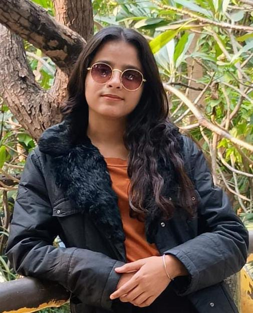

<html lang="en">
<head>
    <meta charset="UTF-8">
    <meta name="viewport" content="width=device-width, initial-scale=1.0">
    <title>Sharda Yadav - Portfolio</title>
    <link rel="stylesheet" href="styles.css">
    
</head>
<body>
    <header>
        
        <h1>Sharda Yadav</h1>
        <h2>Backend Developer | Problem Solver</h2>
    </header>

    

        <h3 class="section-title">Profile Summary</h3>
        
Passionate Backend Developer with a strong background in programming, problem-solving, and software development. Proficient in modern backend technologies with a keen interest in scalable and efficient software solutions.

        <h3 class="section-title">Academic Projects</h3>
        

            <h3>Jarvis Automation</h3>
            
<strong>Tools:</strong> Python, Speech Recognition, WebDriver, OS

            
Developed an AI assistant for automating daily system tasks efficiently.

        

        

            <h3>Security Camera</h3>
            
<strong>Tools:</strong> Python, OpenCV, Facial Recognition

            
Built a security system that detects intruders and alerts the user.

        

        <h3 class="section-title">Technical Skills</h3>
        

            
Java

            
Python

            
Go

            
SQL

            
MySQL

            
Data Structures

            
Agile Development

            
Debugging

        

        <h3 class="section-title">Contact</h3>
        
Email: <a href="mailto:sharda9696018592@gmail.com">sharda9696018592@gmail.com</a>

        
Phone: 8726701002

        
LinkedIn: <a href="https://www.linkedin.com/in/sharda-yadav-713925272">Sharda Yadav</a>

    

    <footer>
        
&copy; 2024 Sharda Yadav | All Rights Reserved

    </footer>
</body>
</html>
